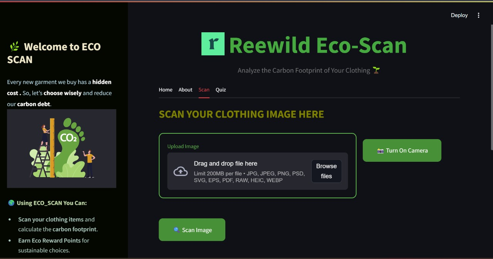
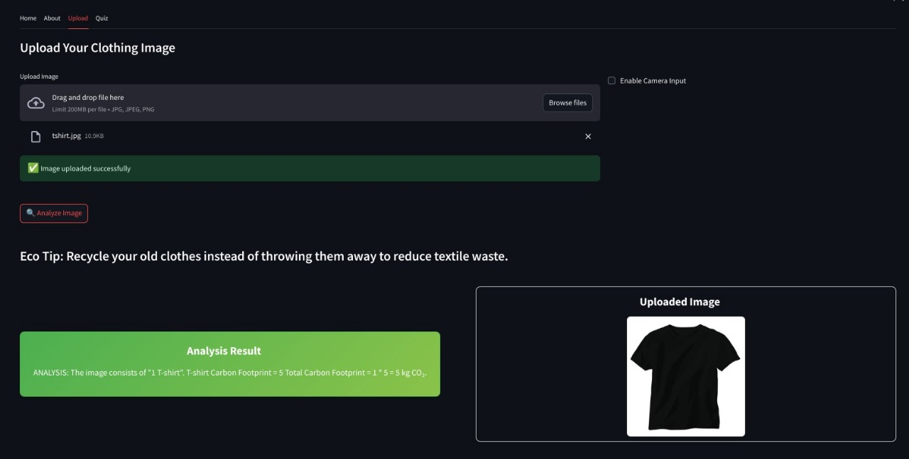

# 🌍 EcoScan – Clothing Carbon Footprint Scanner

**EcoScan** is a web app that helps users measure the environmental impact of their clothing choices. It uses AI to analyze clothing images, estimates their carbon footprint, awards eco-points, and displays redeemable offers for sustainable actions.

---

## ✨ Key Features

### 🔹 Frontend

- Upload images via file or camera
  - Identifies clothing items
  - Calculates carbon footprint
  - Awards eco-reward points
- Browse and redeem sustainable offers

### 🔹 Backend

- AI-powered image recognition using GPT-4 Vision
- Carbon scoring using in-memory logic
- Offer system based on points earned

---

## 🧰 Tech Stack

- **Frontend**: Streamlit  
- **Backend**: Python  
- **AI Model**: GPT-4 Vision (gpt-4o)  
- **Storage**: In-memory (Python dictionaries)

---

---

## 📸 Screenshots

### 🖼️ App Walkthrough


*Step 1: Upload a clothing image*



*Step 2: View item identification and carbon score*


*Step 3: Earn eco-reward points via quiz*

## ⚙️ Getting Started

### 1. Requirements

- Python 3.8 or above  
- Streamlit  
- OpenAI API Key (get one from https://platform.openai.com)

### 2. Installation

```bash
git clone https://github.com/Samraatrichy/Eco-Scan-Challenge
cd Eco-Scan-Challenge
pip install -r requirements.txt


